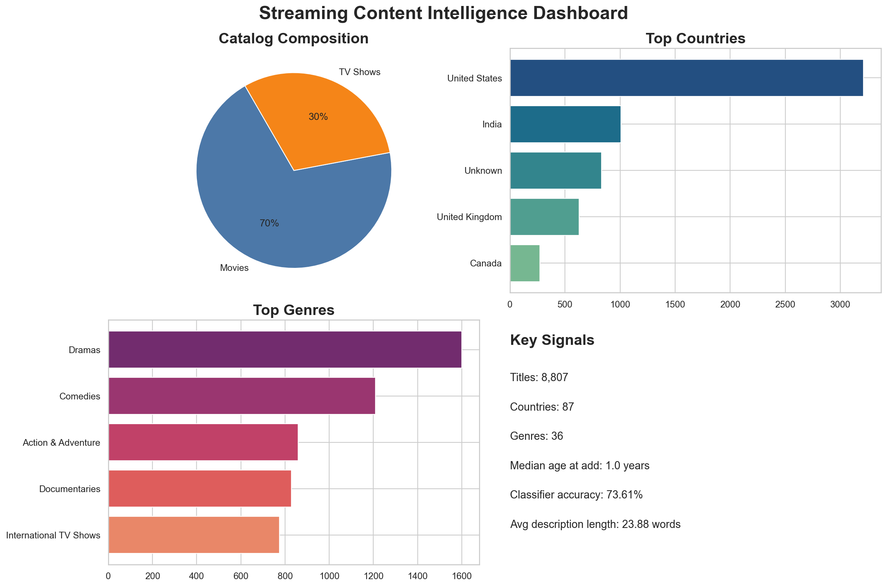
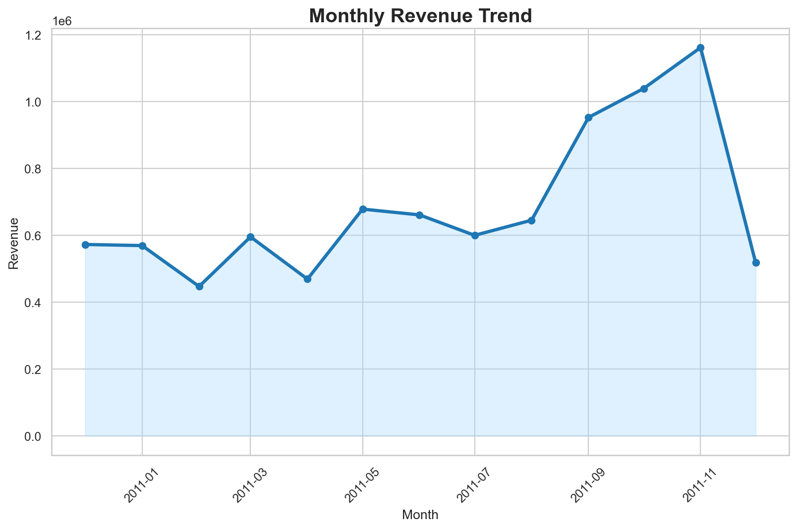
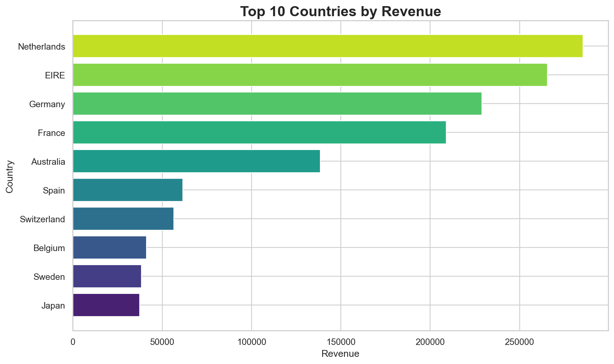
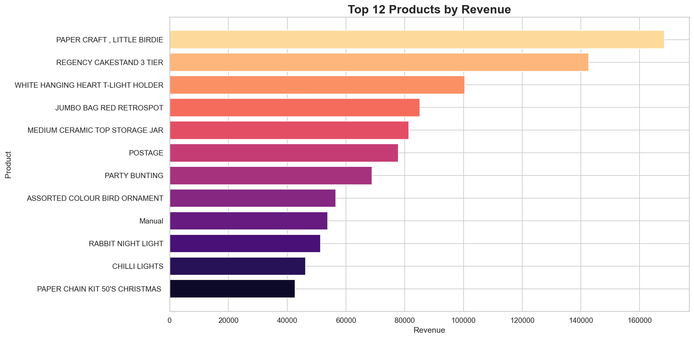
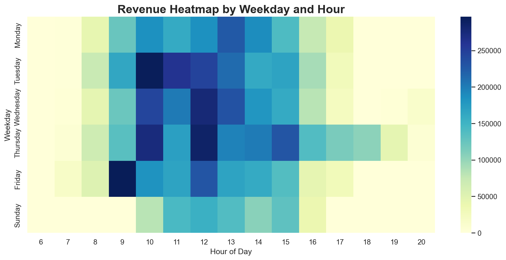
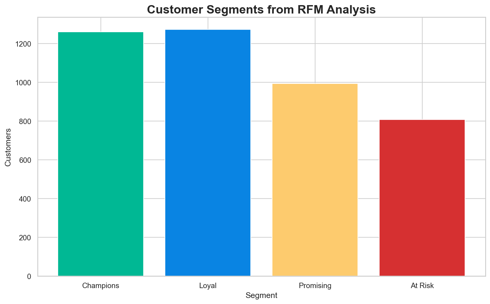

# Applied Science Retail Analytics Project

A role-aligned applied science portfolio project built around the UCI Online Retail dataset. This repository presents a complete analysis workflow with a Python script, a Jupyter notebook, generated visuals, and processed summary outputs.



## Why This Matches Applied Science

This project is framed to match an Applied Science internship because it demonstrates:

- large-scale transactional data cleaning and feature engineering
- customer behavior modeling with Recency, Frequency, and Monetary signals
- quantitative segmentation for decision support
- business-focused statistical analysis with clear visual communication
- reproducible analytics workflows that can support downstream machine learning or experimentation

## Project Focus

This project answers practical statistics and business questions:

- How does revenue change over time?
- Which countries drive the most sales?
- Which products generate the highest revenue?
- What does the order-value distribution look like?
- When are purchases most active during the week?
- How can customers be segmented using Recency, Frequency, and Monetary behavior?

## Key Results

- Cleaned transaction records: `397,884`
- Unique customers: `4,338`
- Countries covered: `37`
- Study period: `2010-12-01` to `2011-12-09`
- Total revenue: `$8,911,407.90`
- Average order value: `$480.87`
- Median order value: `$303.04`

## Repository Structure

```text
Statistic/
├── data/
│   ├── raw/
│   │   └── online_retail.xlsx
│   └── processed/
│       ├── customer_rfm_segments.csv
│       ├── monthly_revenue.csv
│       ├── summary_metrics.json
│       ├── top_countries.csv
│       └── top_products.csv
├── notebooks/
│   └── applied_science_retail_analytics.ipynb
├── scripts/
│   └── applied_science_retail_analysis.py
├── visuals/
│   ├── customer_value_map.png
│   ├── executive_dashboard.png
│   ├── monthly_revenue_trend.png
│   ├── order_value_distribution.png
│   ├── revenue_heatmap.png
│   ├── rfm_segments.png
│   ├── top_countries_revenue.png
│   └── top_products_revenue.png
├── requirements.txt
└── README.md
```

## Visual Gallery

### Monthly Revenue



### Top Countries by Revenue



### Top Products by Revenue



### Revenue Heatmap



### RFM Segments



## Statistical Workflow

1. Load the online retail transaction file.
2. Remove missing customer IDs, cancellations, non-positive quantities, and non-positive prices.
3. Create revenue features and monthly time variables.
4. Compute descriptive statistics and grouped summaries.
5. Visualize time trends, country performance, product performance, and order-value behavior.
6. Build customer segments using RFM scoring.

## How To Run

Install dependencies:

```bash
pip install -r requirements.txt
```

Run the analysis script:

```bash
python3 scripts/applied_science_retail_analysis.py
```

Open the notebook:

```bash
jupyter notebook notebooks/applied_science_retail_analytics.ipynb
```

## Dataset

The dataset used in this project is the Online Retail Excel dataset copied into:

`data/raw/online_retail.xlsx`

## Notes

- The script generates all visuals and processed files automatically.
- The notebook mirrors the project logic in a presentation-friendly format.
- The repository intentionally avoids empty folders and unnecessary files.
- The framing emphasizes customer analytics and segmentation to better match Applied Science internship expectations.
