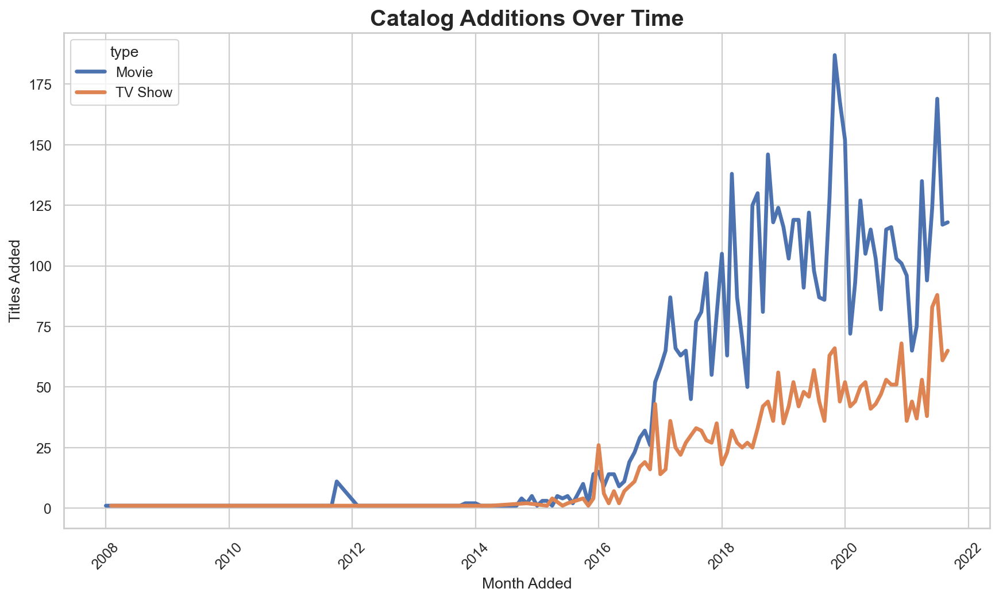
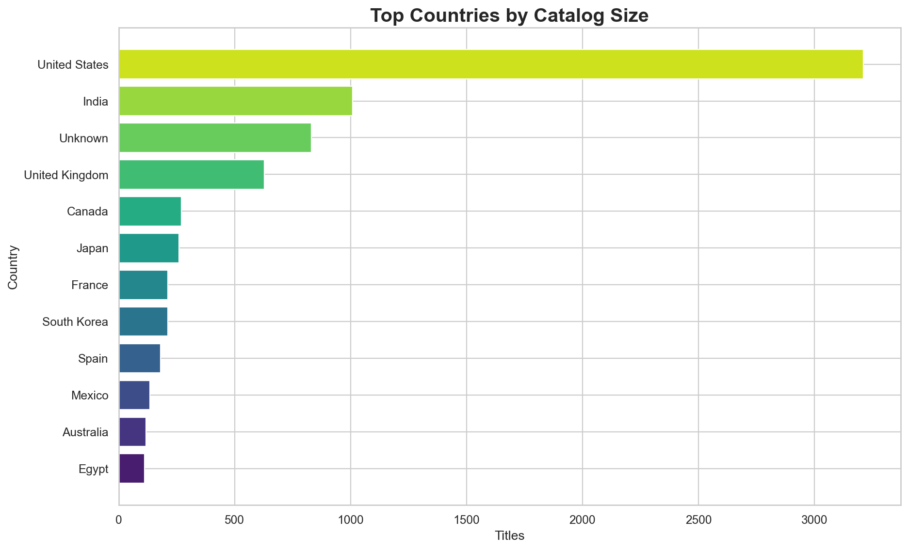
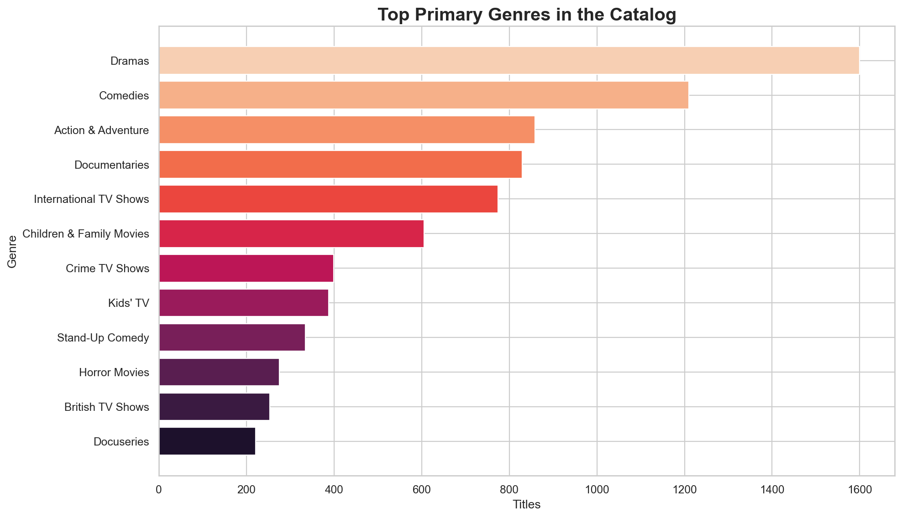
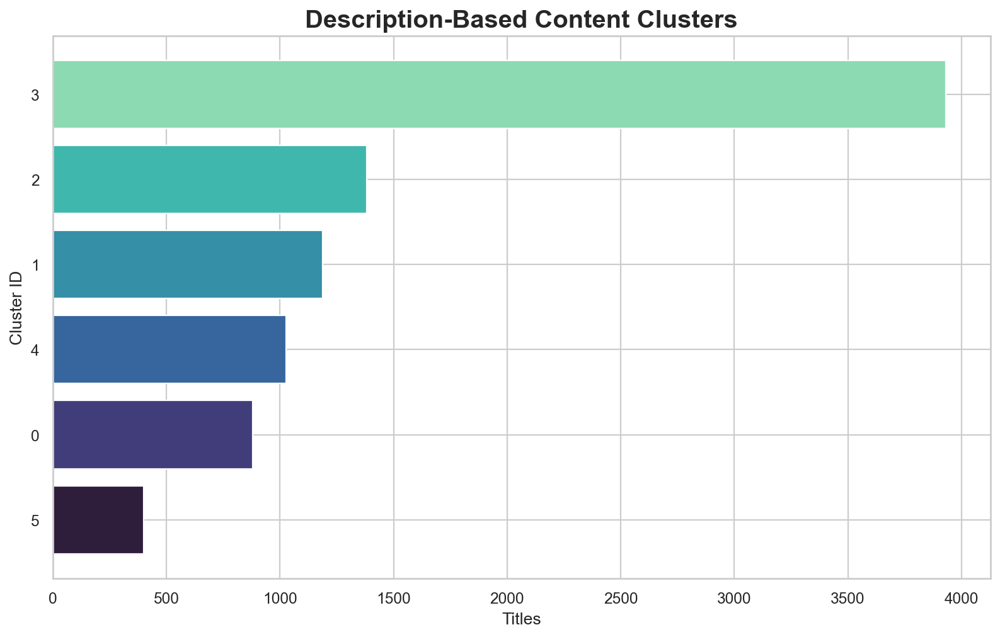
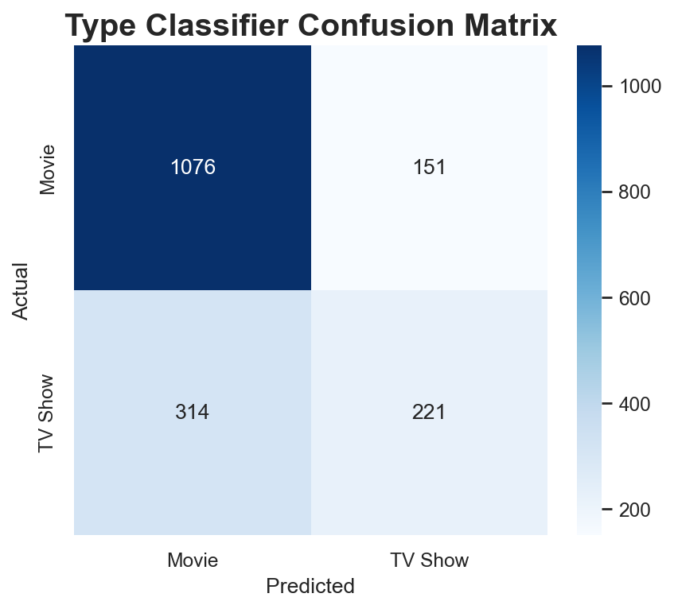

# Streaming Content Intelligence

A polished analytics and modeling project built around the Netflix catalog dataset. This repository combines exploratory analysis, statistical testing, unsupervised clustering, and lightweight predictive modeling to study how a global streaming catalog is structured.


## Why This Project Stands Out

This project is designed to feel modern and recruiter-friendly by showing:

- end-to-end data cleaning and feature engineering
- decision-oriented catalog analytics
- statistical inference with bootstrap confidence intervals and hypothesis testing
- text-based content clustering with TF-IDF and KMeans
- predictive modeling with an interpretable baseline classifier
- an interactive Streamlit application for recruiter-friendly exploration
- reproducible outputs, tests, and an executive summary artifact

## Business Questions

- How is the catalog split between movies and TV shows?
- Which countries and genres dominate the platform?
- How long after release are titles typically added to the catalog?
- Are rating distributions different for movies and TV shows?
- What natural content clusters emerge from title and description text?
- How well can simple metadata predict title type?

## Key Results

- Total titles analyzed: `8,807`
- Movies: `6,131`
- TV shows: `2,676`
- Countries represented: `87`
- Genres represented: `36`
- Catalog release range: `1925` to `2021`
- Average description length: `23.88` words
- Median content age at platform arrival: `1.0` year

## Repository Structure

```text
Statistic/
├── data/
│   ├── raw/
│   │   └── netflix_titles.csv
│   └── processed/
│       ├── content_clusters.csv
│       ├── country_catalog.csv
│       ├── genre_catalog.csv
│       ├── model_metrics.json
│       ├── statistical_tests.json
│       └── summary_metrics.json
├── notebooks/
│   └── streaming_content_intelligence.ipynb
├── app/
│   └── streamlit_app.py
├── reports/
│   └── executive_summary.md
├── scripts/
│   └── streaming_content_intelligence.py
├── tests/
│   └── test_project_outputs.py
├── visuals/
│   ├── catalog_additions_timeline.png
│   ├── content_age_distribution.png
│   ├── content_clusters.png
│   ├── executive_dashboard.png
│   ├── rating_mix.png
│   ├── top_countries_catalog.png
│   ├── top_genres_catalog.png
│   └── type_classifier_confusion_matrix.png
├── pyproject.toml
├── requirements.txt
└── README.md
```

## Visual Highlights

### Catalog Additions Timeline



### Top Countries



### Top Genres



### Content Clusters



### Type Classifier



## Technical Workflow

1. Load and clean the catalog dataset.
2. Engineer country, genre, cast-size, description-length, and catalog-timing features.
3. Quantify platform composition and content timing patterns.
4. Test catalog behavior differences with chi-square and Mann-Whitney U tests.
5. Discover content families with TF-IDF text features and KMeans clustering.
6. Train a baseline classifier to predict whether a title is a movie or TV show.
7. Export decision-ready visuals, summary files, and an executive report.

## How To Run

Install dependencies:

```bash
pip install -r requirements.txt
```

Or install from project metadata:

```bash
pip install .
```

Run the pipeline:

```bash
python3 scripts/streaming_content_intelligence.py
```

Open the notebook:

```bash
jupyter notebook notebooks/streaming_content_intelligence.ipynb
```

Run the Streamlit app:

```bash
streamlit run app/streamlit_app.py
```

## Notes

- The project avoids unrelated assets and empty folders.
- `reports/executive_summary.md` provides a concise stakeholder-facing summary.
- `tests/test_project_outputs.py` provides a lightweight validation layer for the generated artifacts.
- `app/streamlit_app.py` provides an interactive demo layer that is easier for recruiters to review quickly.
